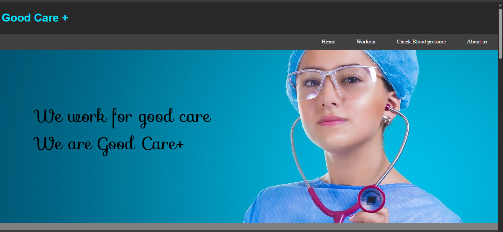
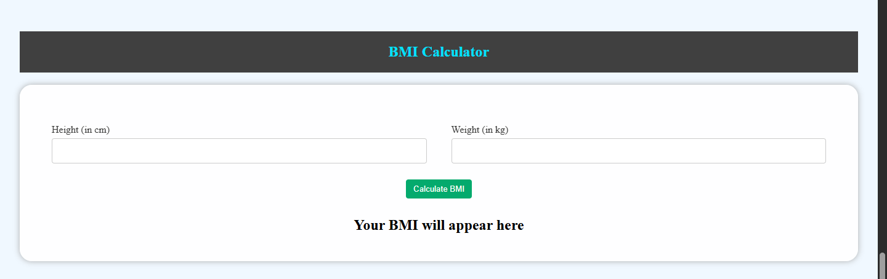
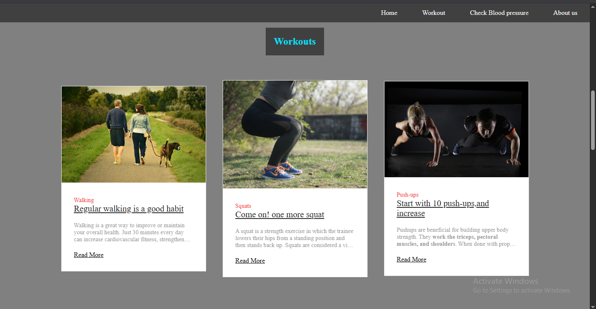
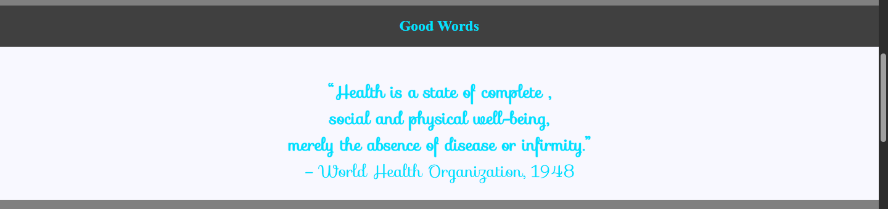

# Good Care+ 🩺💪

**Good Care+** is a simple and responsive health and wellness web application designed to promote a healthier lifestyle. It offers workout tips, a blood pressure calculator, and a BMI calculator — all in one clean and elegant interface.

## 🚀 Demo

👉 [Live Demo on GitHub Pages]()

---

## 🌟 Features

- 🧠 **Health Inspiration**: Motivational health quotes on the landing page.
- 💪 **Workout Blogs**: Informative workout blogs on Walking, Squats, and Push-ups.
- ❤️ **Blood Pressure Calculator**: Check your systolic and diastolic pressure and see instant results.
- ⚖️ **BMI Calculator**: Quickly calculate your Body Mass Index.
- 📱 **Responsive Design**: Works well on desktops, tablets, and mobile devices.
- 🌐 **Simple Navigation**: Easy-to-use navbar for a smooth user experience.

---

## 🛠️ Tech Stack

- **HTML5**
- **CSS3**
- **JavaScript**
- **Responsive Design Techniques**

---

## 📸 Screenshots

> 
> 
> 
> 
> 

---

## 🧪 How to Use

1. **Clone the Repository:**

   ```bash
   git clone https://github.com/yuvraj1129/good-care-plus.git
   cd good-care-plus

   ```

2. **Open in Browser:**

You can simply open the index.html file in your preferred web browser.

No build tools or server setup required.

```

## Project Structure

good-care-plus/
├── index.html
├── style/
│   └── style.css
├── img/
│   ├── walking.jpg
│   ├── squats.jpg
│   ├── pushups.jpg
│   ├── icon.ico
│   └── me.png
├── blogs/
│   ├── blog1.html
│   ├── blog2.html
│   └── blog3.html
├── text.js
└── README.md

```

## 📬 Contact

Made with ❤️ by Yuvraj Sharma
📧 www.linkedin.com/in/yuvthetechie22
